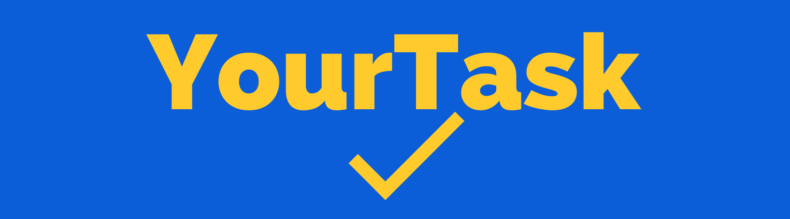

  
  <h2>Organize e Realize suas tarefas.</h2>

 

  <h2 align="center" >&rArr; PROJETO AINDA EM CONSTRUÇÃO &lArr;</h2>

 

  <h2 > Overview da Aplicação</h2>
   
  <h3 >YourTask é Aplicação web que consiste em um To do List, onde o Usuario pode criar projetos e dentro destes projetos uma lista de tarefas a fazer.</h3>
   

    
  <h3> Requisitos do Negócio</h3>
  <ul >
    <li >Cadastro, listagem, atualização e remoção de Usuarios, projetos e tarefas</li>
    <li>Login e Autenticação de Usuarios</li>
    <li>Criptografia de Senha de Usuario</li>
     <li>Guarda de Rotas</li>
    <li>Utilização de formularios</li>
     <li>Validações de campos dos formularios</li>
     <li>Bootstrap</li>
     <li>Lazzy Load</li>
  </ul>

  <h2 >Tecnologias & Ferramentas utilizadas </h2>
  
   
  

    
    
    
    
    
    
  

